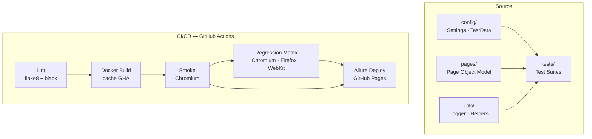

# Playwright Python Automation Framework

[](https://github.com/yhtyyar/demoqa-playwright/actions/workflows/tests.yml)
[](https://yhtyyar.github.io/demoqa-playwright)
[](https://python.org)
[](https://playwright.dev/python/)
[](https://www.docker.com/)
[](https://github.com/psf/black)
[](https://opensource.org/licenses/MIT)

> **QA Automation Portfolio** — enterprise-grade test framework built with Playwright, Python and Docker.  
> **70+ test cases** · **3 browser engines** · **Live Allure Report** · **Full CI/CD pipeline**

**[→ Live Allure Report](https://yhtyyar.github.io/demoqa-playwright)** — interactive test results with trend history, updated on every push to `main`.

---

## What makes this project stand out

| Capability | Implementation |
| --- | --- |
| **Browser coverage** | Chromium, Firefox, WebKit in parallel CI matrix — one commit covers all engine families |
| **Zero flakiness strategy** | All waits encapsulated in `BasePage`; no `sleep()`, no hardcoded timeouts in test code |
| **Playwright-specific scenarios** | `dialog` handler for alerts/prompt, `context.expect_page()` for new tabs, nested `frame_locator()` |
| **Reproducible runs** | Docker + `gosu` solve UID mismatch on volume mounts — identical behaviour locally and in CI |
| **Living documentation** | Allure Report auto-deployed to GitHub Pages with per-run history trend |
| **Commit-time quality gate** | `pre-commit` with `black` + `flake8` rejects non-conforming code before it reaches CI |

---

## Architecture



### Key design decisions

| Decision | Why |
| --- | --- |
| **Sync Playwright API** | Deterministic execution flow, no `await` chains, easier stack traces |
| **`BasePage` centralises all waits** | Test code describes *what*, never *how long to wait* |
| **Faker for test data** | Unique data per run, no shared state between tests |
| **Docker ENTRYPOINT + gosu** | Safe UID switch on volume mount — eliminates `PermissionError` in CI |
| **`fail-fast: false` in matrix** | One browser failure doesn't hide results from the others |
| **`--clean-alluredir` in pytest.ini** | Stale results from previous runs never pollute the current report |

---

## Test coverage

| Section | Pages covered | Test cases | Highlights |
| --- | --- | --- | --- |
| **Elements** | 8 / 8 | 25+ | Full CRUD on Web Tables, invalid email validation |
| **Forms** | 1 / 1 | 5 | Required-field guard, gender radio, modal assertion |
| **Alerts / Frame / Windows** | 5 / 5 | 16 | `dialog` API, `expect_page()`, nested `frame_locator()` |
| **Widgets** | 3 / 9 | 14 | Accordion, Date Picker, Slider with JS value set |

---

## Tech stack

| Tool | Role |
| --- | --- |
| **Python 3.11** | Language |
| **Playwright 1.42** | Browser automation (sync API) |
| **pytest 8** | Test runner — fixtures, markers, plugins |
| **allure-pytest** | Rich HTML reports with step-level detail |
| **Faker** | Isolated, randomised test data per run |
| **Docker + gosu** | Hermetic test environment |
| **flake8 + black** | Static analysis and auto-formatting |
| **pre-commit** | Local quality gate before every commit |
| **GitHub Actions** | CI/CD: lint → build → smoke → regression → Allure Pages |

---

## Quick start

### Docker (recommended)

```bash
git clone git@github.com:yhtyyar/demoqa-playwright.git
cd demoqa-playwright

docker compose run --rm smoke             # P0 smoke tests
docker compose run --rm regression        # full regression, Chromium
docker compose run --rm tests-firefox     # Firefox only
docker compose run --rm tests-webkit      # WebKit only
```

Reports are written to `reports/` on the host.

### Local setup

```bash
python -m venv venv && source venv/bin/activate   # Windows: venv\Scripts\activate
pip install -r requirements.txt
playwright install
cp .env.example .env
```

```bash
pytest -m smoke                           # smoke suite
pytest                                    # full suite
BROWSER=firefox pytest -m regression     # specific engine
pytest -m smoke && allure serve reports/allure-results  # with live report
```

### Pre-commit hooks

```bash
pre-commit install           # register hooks once
pre-commit run --all-files   # run manually at any time
```

---

## Project structure

```text
demoqa-playwright/
├── .github/workflows/tests.yml        # CI: lint → build → smoke → regression → allure deploy
├── config/
│   ├── settings.py                    # ENV-driven config (BASE_URL, BROWSER, TIMEOUT)
│   └── test_data.py                   # Faker-generated test data
├── pages/                             # Page Object Model
│   ├── base_page.py                   # All wait/action/assertion primitives
│   ├── main_page.py
│   ├── elements/                      # Text Box, Check Box, Radio, Buttons, Web Tables,
│   │   └── ...                        #   Links, Upload/Download, Dynamic Properties
│   ├── alerts_frame_windows/          # Alerts, Browser Windows, Frames, Modal Dialogs
│   └── widgets/                       # Accordion, Date Picker, Slider
├── tests/
│   ├── test_smoke.py                  # P0 — critical path
│   ├── test_elements.py               # P1 — Elements section (full CRUD)
│   ├── test_elements_extended.py      # P1 — Links API, Upload/Download, Dynamic Properties
│   ├── test_alerts_frames_windows.py  # P1 — dialog/iframe/new-tab/modal
│   ├── test_widgets.py                # P2 — Accordion, Date Picker, Slider
│   └── test_forms.py                  # P1 — Practice Form
├── utils/
│   ├── helpers.py
│   └── logger.py
├── conftest.py                        # Fixtures: browser → context → page
├── pytest.ini                         # Markers + alluredir
├── pyproject.toml                     # black config (line-length = 120)
├── setup.cfg                          # flake8 config
├── .pre-commit-config.yaml            # black + flake8 + trailing-whitespace
├── Dockerfile                         # mcr.microsoft.com/playwright/python + gosu
├── docker-compose.yml                 # smoke / regression / per-browser services
└── entrypoint.sh                      # UID fix + gosu exec
```

---

## CI/CD triggers

| Event | Pipeline |
| --- | --- |
| **Push** `main` / `develop` | Lint → Build → Smoke → Allure Deploy |
| **Pull Request** → `main` | Lint → Build → Smoke → JUnit comment |
| **Nightly** `02:00 UTC` | Full pipeline + 3-browser Regression |
| **Manual dispatch** | Selectable test marker |

---

## Docs

- [Style Guide](docs/STYLE_GUIDE.md)
- [Contributing](docs/CONTRIBUTING.md)
- [Test Plan](docs/test_plan.md)
- [Test Cases](docs/test_cases.md)
- [Bug Report Template](docs/bug_report_template.md)

---

## Author

**Ykhtyar Kadyrov** — QA Automation Engineer  
[GitHub](https://github.com/yhtyyar) · [Email](mailto:kadyrow1506@gmail.com)
