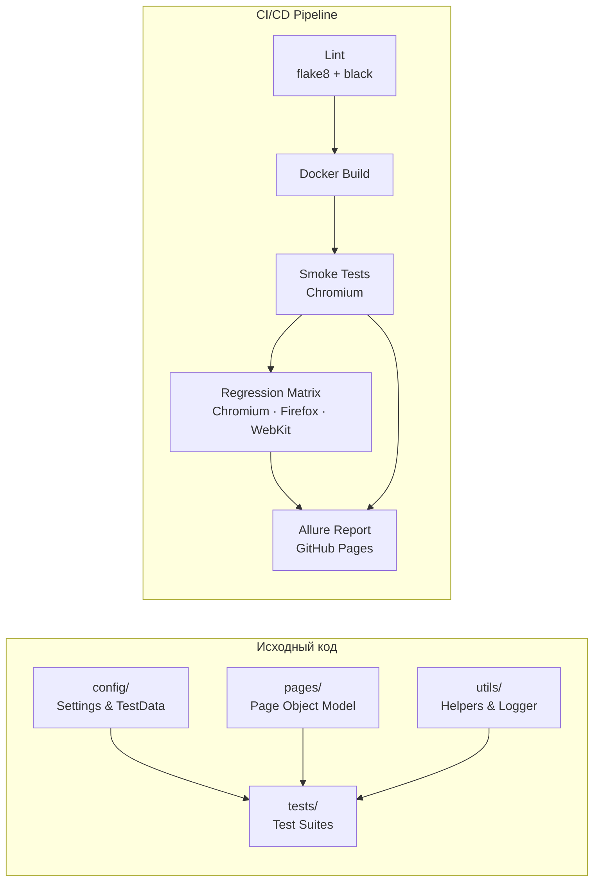

# DemoQA Playwright Automation Framework

[](https://github.com/yhtyyar/demoqa-playwright/actions/workflows/tests.yml)
[](https://yhtyyar.github.io/demoqa-playwright)
[](https://python.org)
[](https://playwright.dev/python/)
[](https://www.docker.com/)
[](https://github.com/psf/black)
[](https://opensource.org/licenses/MIT)

Производственный фреймворк автоматизированного тестирования для [DemoQA](https://demoqa.com/) на базе **Playwright + Python + pytest + Docker**.

**[Живой Allure Report](https://yhtyyar.github.io/demoqa-playwright)** — интерактивные результаты с историей прогонов, трендами и детальными шагами.

---

## Почему стоит посмотреть этот проект

- **Page Object Model** с базовым классом и переиспользуемыми методами ожидания — устойчив к флакинессу
- **Полная Docker-изоляция**: тесты идентичны локально и в CI, нет проблемы «у меня работает»
- **Кросс-браузерная матрица** в CI: Chromium / Firefox / WebKit за один пайплайн
- **Allure Reports на GitHub Pages** с историей трендов — результаты доступны по ссылке без скачивания артефактов
- **Pre-commit hooks**: black + flake8 не пропускают некорректный код даже на уровне коммита

---

## Архитектура



### Ключевые архитектурные решения

| Решение | Обоснование |
| --- | --- |
| **Sync Playwright API** | Детерминированный поток выполнения, нет `await`-цепочек, проще отлаживать |
| **`page.wait_for_selector` в `BasePage`** | Все ожидания инкапсулированы — тесты не знают о тайминге |
| **Faker для тестовых данных** | Изолированные данные на каждый прогон, нет зависимостей между тестами |
| **Docker ENTRYPOINT + gosu** | Безопасная смена UID при volume mount — нет PermissionError в CI |
| **`fail-fast: false` в матрице** | Падение одного браузера не прерывает проверку остальных |

---

## Стек технологий

| Технология | Назначение |
| --- | --- |
| **Python 3.11** | Язык программирования |
| **Playwright 1.42** | Браузерная автоматизация (sync API) |
| **pytest 8** | Тестовый фреймворк, фикстуры, маркеры |
| **Allure pytest** | Интерактивные отчёты с историей прогонов |
| **Docker + gosu** | Воспроизводимая среда, безопасный volume mount |
| **Faker** | Генерация тестовых данных |
| **flake8 + black** | Линтинг и форматирование кода |
| **pre-commit** | Проверки качества на уровне коммита |
| **GitHub Actions** | CI/CD: lint → build → smoke → regression → Allure Pages |

---

## Быстрый старт

### Docker (рекомендуется)

```bash
git clone git@github.com:yhtyyar/demoqa-playwright.git
cd demoqa-playwright

# Smoke-тесты
docker compose run --rm smoke

# Regression на конкретном браузере
docker compose run --rm tests-firefox
docker compose run --rm tests-webkit

# Все браузеры
docker compose run --rm regression
```

Отчёты сохраняются в `reports/` на хост-машине.

### Локальная установка

```bash
python -m venv venv && source venv/bin/activate  # Linux/macOS
# venv\Scripts\activate                           # Windows

pip install -r requirements.txt
playwright install

cp .env.example .env
```

### Запуск тестов

```bash
# Smoke-тесты
pytest -m smoke

# С Allure-отчётом (превью в браузере)
pytest -m smoke
allure serve reports/allure-results

# Полный regression
pytest

# Конкретный браузер
BROWSER=firefox pytest -m smoke
```

### Pre-commit hooks

```bash
pre-commit install       # установить hooks
pre-commit run --all-files  # проверить весь код
```

---

## CI/CD Pipeline

### Архитектура пайплайна

```text
push / PR                          schedule (nightly) / main
    │                                        │
    ▼                                        ▼
┌──────────┐                         ┌──────────┐
│   Lint   │  flake8 + black         │   Lint   │
└────┬─────┘                         └────┬─────┘
     ▼                                    ▼
┌──────────┐                         ┌──────────┐
│  Build   │  Docker image + cache   │  Build   │
└────┬─────┘                         └────┬─────┘
     ▼                                    ▼
┌──────────┐                         ┌──────────┐
│  Smoke   │  Chromium               │  Smoke   │
└────┬─────┘                         └────┬─────┘
     │                              ┌─────┼──────┐
     │                              ▼     ▼      ▼
     │                          Chrome Firefox WebKit
     │                              └─────┼──────┘
     ▼                                    ▼
┌──────────┐                     ┌─────────────────┐
│  Report  │ JUnit → PR comment  │  Deploy Allure  │ → GitHub Pages
└──────────┘                     └─────────────────┘
```

### Триггеры

| Событие | Что запускается |
| --- | --- |
| **Push** (main/develop) | Lint → Build → Smoke → Report + Allure Deploy |
| **Pull Request** | Lint → Build → Smoke → JUnit Report |
| **Nightly** (02:00 UTC) | Lint → Build → Smoke → Regression (3 браузера) → Allure Deploy |
| **Manual dispatch** | Настраиваемый маркер тестов |

### Артефакты

- **Allure Report** — [живой отчёт на GitHub Pages](https://yhtyyar.github.io/demoqa-playwright) с историей прогонов
- **HTML-отчёты** — pytest-html за каждый прогон
- **JUnit XML** — результаты в формате JUnit (комментарий к PR)
- **Скриншоты** — снимки экрана при падении тестов

---

## Структура проекта

```text
demoqa-playwright/
├── .github/workflows/
│   └── tests.yml            # CI: lint → build → smoke → regression → allure
├── config/
│   ├── settings.py          # Env-конфигурация (BASE_URL, BROWSER, TIMEOUT)
│   └── test_data.py         # Тестовые данные через Faker
├── pages/                   # Page Object Model
│   ├── base_page.py         # Базовые методы ожидания и навигации
│   ├── main_page.py
│   └── elements/
│       ├── text_box_page.py
│       ├── check_box_page.py
│       ├── radio_button_page.py
│       ├── buttons_page.py
│       └── web_tables_page.py
├── tests/
│   ├── test_smoke.py        # P0: критический функционал
│   ├── test_elements.py     # P1: все Elements-секции
│   └── test_forms.py        # P1: формы
├── utils/
│   ├── helpers.py
│   └── logger.py
├── docs/                    # Тест-план, тест-кейсы, style guide
├── reports/                 # Артефакты (gitignore, кроме .gitkeep)
├── conftest.py              # Фикстуры: browser / context / page / main_page
├── pytest.ini               # Конфиг pytest + alluredir
├── setup.cfg                # flake8 config
├── .pre-commit-config.yaml  # black + flake8 + pre-commit-hooks
├── Dockerfile               # Playwright + gosu образ
├── docker-compose.yml       # Сервисы: smoke / regression / браузеры
└── entrypoint.sh            # Безопасный volume mount + gosu
```

---

## Маркировка тестов

| Маркер | Описание | Приоритет |
| --- | --- | --- |
| `smoke` | Критический функционал, быстрая обратная связь | P0 |
| `regression` | Основной функционал, полное покрытие | P1 |
| `ui` | Валидация UI-элементов | P2 |

---

## Настройка GitHub Pages (одноразово)

После первого пуша в `main`:

1. Перейти в `Settings → Pages`
2. Source: **Deploy from a branch**
3. Branch: **gh-pages** / `/ (root)`
4. Сохранить — через 2-3 минуты отчёт появится по адресу `https://yhtyyar.github.io/demoqa-playwright`

---

## Документация

- [Руководство по стилю](docs/STYLE_GUIDE.md)
- [Руководство для контрибьюторов](docs/CONTRIBUTING.md)
- [Тест-план](docs/test_plan.md)
- [Тест-кейсы](docs/test_cases.md)
- [Шаблон баг-репорта](docs/bug_report_template.md)
